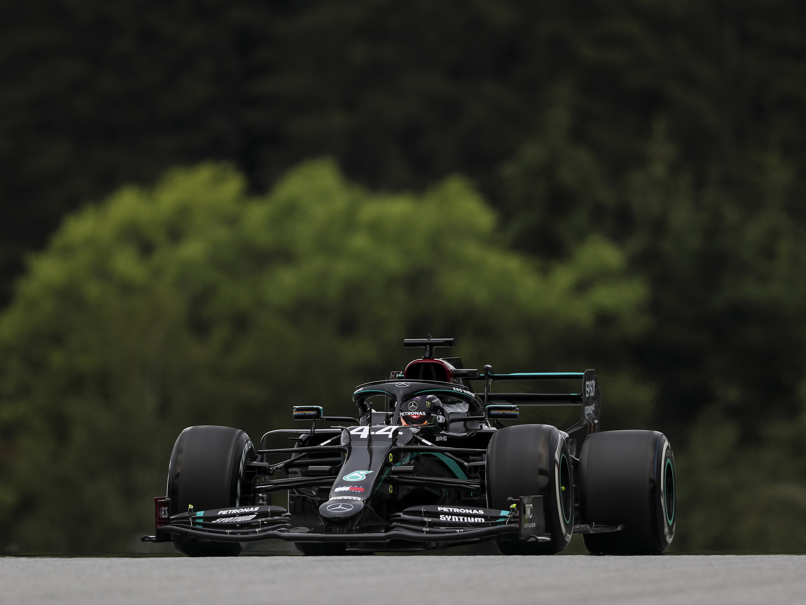

<!-- Badges from: https://github.com/Ileriayo/markdown-badges -->

<div align="center">


<div align="center">

[](https://gist.github.com/Solomon-Dbw/3ba012f94efa04ae7c216e753c882052)


<!-- Replace with your image path -->


<div align="center">

  ```diff
  + student
  + developer
  ```

</div>

<div align="left">

 - ✝️ Child of God
 - 🏎️ Car enthusiast
 - 🐍 Python lover
 - 🐧 Average Linux enjoyer
 - 🤓 I use Arch btw

</div>

<br>

### <div align="middle">  </div>

<div align="center">

  <table align="center">
    <tr>
      <td align="center">
         
      </td>
      <td align="center">
        
      </td>
    </tr>
  </table>

  <sub>( If it BREAKS press **``CTRL + R``** )</sub>

</div>

<br>

<div align="center">

  [](https://github.com/sponsors/Solomon-Dbw)

  <br>

  <details>
   <summary>Click to unwrap more</summary>

   <br>

   *Tools I Use:*

   <div align="center">

   
   
   
   
   
   
   

   </div>


  </details>

</div>
